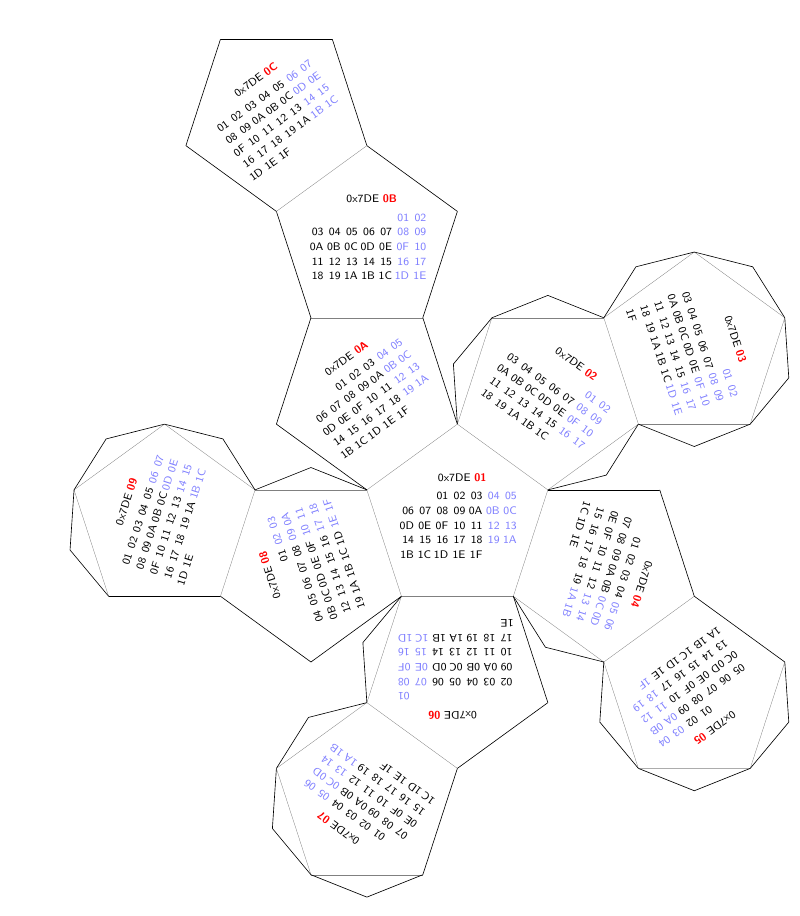

Hexadecimal calendar
====================

Calendar based on [this texexample](http://www.texample.net/tikz/examples/foldable-dodecahedron-with-calendar/)
texexample and on [this post](http://habrahabr.ru/post/207962/).
